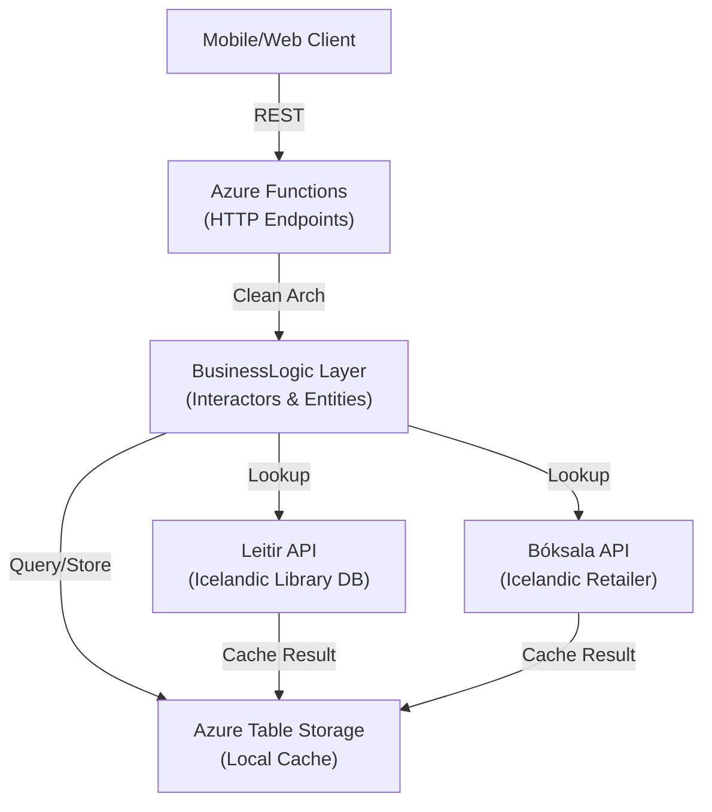

# LibraryCop Backend

A clean architecture REST API that powers Bókasapp, a library management system for small libraries in Iceland. Built on .NET 6 and Azure Functions, it chains multiple book sources (local cache, Leitir API, Bóksala API) to provide fast, reliable book lookups. The backend handles user authentication, book registration, borrowing workflows, and multi-source data aggregation.

> **Status:** Portfolio piece. Maintained as a CV and EMBA showcase, not as production software.

## Tech Stack

- .NET 6 with C# 10
- Azure Functions v4 (HTTP triggers)
- Azure Table Storage
- xUnit and Moq for testing
- Clean Architecture pattern (controllers, interactors, entities)
- HMAC SHA256 JWT authentication

## Architecture



### Project Structure

- **BackendFunctions**: Azure Functions entry points and HTTP handlers
- **BusinessLogic**: Interactors (use cases), entities, and controllers (data access)
- **UnitTest**: xUnit tests for critical business logic paths

## Related Repositories

- [Frontend](https://github.com/kromby/LibraryCop.Frontend) - Flutter app for iOS, Android, Web, Windows, macOS, and Linux
- [Web](https://github.com/kromby/LibraryCop.Web) - SvelteKit landing page and admin surface

## Local Development

### Prerequisites

- [.NET 6 SDK](https://dotnet.microsoft.com/en-us/download/dotnet/6.0)
- [Azure Functions Core Tools](https://learn.microsoft.com/en-us/azure/azure-functions/functions-run-local)
- [Azure Storage Emulator](https://learn.microsoft.com/en-us/azure/storage/common/storage-use-azurite) (optional, for local Table Storage)

### Setup

1. Clone and open the repository:
   ```bash
   git clone https://github.com/kromby/LibraryCop.Backend
   cd LibraryCop.Backend
   ```

2. Build the solution:
   ```bash
   dotnet build
   ```

3. Configure `local.settings.json` in the `BackendFunctions` folder. Example:
   ```json
   {
     "IsEncrypted": false,
     "Values": {
       "AzureWebJobsStorage": "UseDevelopmentStorage=true",
       "FUNCTIONS_WORKER_RUNTIME": "dotnet",
       "AzureWebJobsSecretStorageType": "files",
       "JwtSecret": "your-secret-key-here",
       "JwtExpiry": "7"
     }
   }
   ```

4. Run the Azure Functions locally:
   ```bash
   cd LibraryCop.BackendFunctions
   func start
   ```
   Functions will be available at `http://localhost:7251`.

5. Run tests:
   ```bash
   dotnet test
   ```

## Key Features

- **Multi-source book lookup**: Chains local cache, Leitir (Icelandic library database), and Bóksala (retailer API) for comprehensive coverage
- **Automatic result caching**: External API responses are cached in Azure Table Storage to reduce latency and external calls
- **JWT authentication**: 7-day expiring tokens with HMAC SHA256, passed via custom header
- **Clean architecture**: Layered separation of concerns with testable interactors and entities
- **Azure Functions scalability**: HTTP-triggered, on-demand execution with built-in Application Insights

## Known Limitations and Tradeoffs

- **Host key in query string**: Azure Function host key is passed in the query string for simplicity. Production would migrate to header-based auth or Azure AD for better security.
- **No JWT refresh tokens**: Access tokens expire after 7 days with no refresh mechanism. Production would use short-lived access tokens paired with longer-lived refresh tokens.
- **Hardcoded Icelandic UI**: No internationalization framework. Production would adopt `flutter_localizations` and `intl` for multi-language support.
- **Minimal unit test coverage**: Tests focus on critical interactor logic by design. Full coverage would be required for production code.
- **External API dependencies**: Book lookups depend on third-party Icelandic APIs (Leitir, Bóksala). Service interruptions directly impact lookup availability.

## License

MIT License. Copyright (c) 2023 Guðjón Karl.

## Contact

Questions or feedback? Reach out at gudjon@noona.app.
