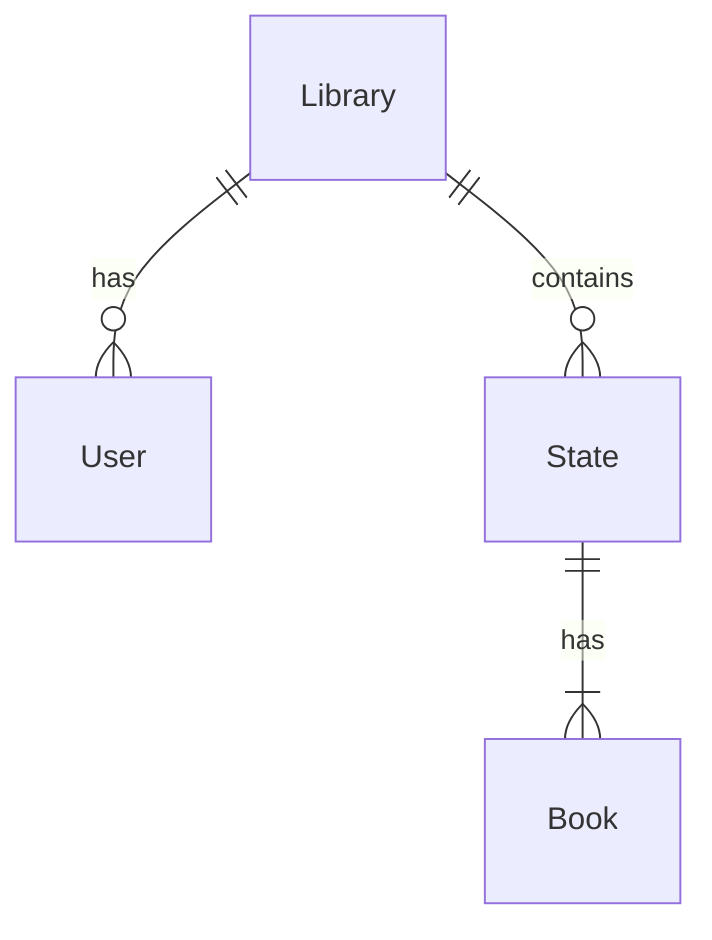

# LibraryCop database

## Tables

### Library
Information about libraries, each kindergarten would have one library.

### User
User information, username, encrypted password and so on. Each user is associated to a single library.

### Book
Book information read from API's or registered directly.

### State
Many-to-many relational table between book and library. Books can be associated with multiple libraries and has a state such in, out on loan.